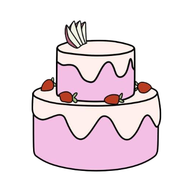

<!DOCTYPE html>
<html lang="en">
<head>
    <meta charset="UTF-8">
    <meta name="viewport" content="width=device-width, initial-scale=1.0">
    <title>Birthday Cake with Flowers</title>
    
</head>
<body>

<audio id="background-music" loop>
    <source src="hbd.mp3" type="audio/mpeg">
    Your browser does not support the audio element.
</audio>

<h1 id="initial-message">Happy Birthday, Alaine! Blow the candles</h1>

    
    
    

<h1 id="new-message" class="hidden-h1">Here's a Virtual bouquet for you!</h1>

</body>
</html>
